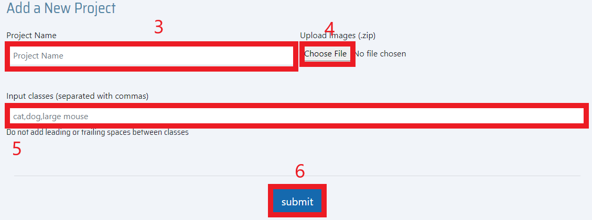
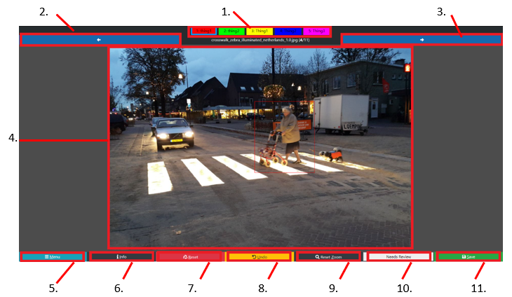

Njobvu-AI is an open-source tool for collaborative image labeling and implementation of computer vision algorithms. Njobvu-AI leverages the neural network frameworks YOLO and Tensorflow to enable in-house computer vision model training and image classification.

Users can annotate images with bounding boxes, use these datasets to train custom models, and apply these models to new images for classification. The validation mode allows users to review and correct model predictions and download data in various formats. Njobvu-AI can be run on both desktop and server hardware using Node.js, allowing users to collaborate on data labeling and image review locally or online.

----------------------------------------------------------------------------------------------------------------------

**Dependencies:**
Node.js

----------------------------------------------------------------------------------------------------------------------

**INSTALLATION:**
======================================================================================================================

**Windows:**
1) Extract the downloaded zip file.
2) Run InstallMe.exe and follow instructions.
3) If you are redirected to the Node.js website, you must install Node.js then restart the InstallMe.exe.
4) After installation is complete, there should now be a labeling-tool shortcut on your desktop.

**Linux and MacOS:**
1) Extract the downloaded zip file.
2) Using the terminal, navigate to the extracted directory.
3) Run "npm i" and "npm i --save sqlite3".

----------------------------------------------------------------------------------------------------------------------

**STARTUP:**

**Windows:**
Use the created shortcut on your desktop
*or*
Run Labeling-Tool.exe in the root directory of the Labeling Tool

**All Platforms:**
1) Using the terminal, navigate to the root directory of the Labeling Tool.
2) Run "node server.js".
3) Go to "http://localhost:8080".

----------------------------------------------------------------------------------------------------------------------

**CREATE AN ACCOUNT:**

1) Go to "http://localhost:8080"
2) On the Login page, click "Signup".
3) Fillout the form.
*Please note that the server is being run on your device and none of this information is sent to nor used by any third party.*
*All information is stored on your local device.*
4) Click the "signup" button to submit the form and be redirected to the Login page.
5) Enter your new Username and Password and hit "Log In".

----------------------------------------------------------------------------------------------------------------------

**CREATE A PROJECT:**

1) Navigate to the home page by logging in.
2) Click "Create Project" in the upper right hand corner.
3) Enter the name of the project. The name must be unique to the projects you have access to.
4) Upload a zip file of images or a single video file. Do NOT upload a folder.
5) Add your classes. These are comma separated names. "cat,dog,large mouse" will be entered as [cat][dog][large mouse].
6) Hit submit to create your project and upload your zipfile. When the upload is done, you will be redirected to the home page.
7) If you selected a video file, fill the incoming prompt with the number of frames you wish your video to be divided by.

**(Optional) Add Image Classification to new photos**
1) Follow previous steps but don't hit submit
2) Select "Check to Enable Image Classification"
3) Select a .data, .cfg, and .weight from your desired training set. Ensure that they are compatible with yolov4.
4) Upload a zip file containg the configuration and weight files. Do NOT upload a folder.
5) Hit submit. Upon completion, your project will be created with every image classified by the uploaded weights file.
----------------------------------------------------------------------------------------------------------------------

**LABELING:**
======================================================================================================================

1. Classes bar. Use to select class.
2. Previous image button. Will save all labels on current image and move to previous image
3. Next image button. Will save all labels on current image and move to next image
4. Labeling area. Used for drawing labels on current image
5. Menu button. Used to see overview of images.
6. Info button. Used to see description of hotkeys.
7. Reset button. Used to delete all labels on current image.
8. Undo button. Used to remove the last label drawn.
9. Reset Zoom button. Used to reset the magnification back to default
10. Needs Review button. Used to select/de-select current image for review
11. Save button. Used to save all labels on current image

**Drawing:**
1) From the home page, click either the project name or the "Project Page" button of the project you want to label.
2) Select the image you would like to label.
3) Select the class you want.
4) Click and drag your mouse over the area you want to tag to draw a box. Release the mouse to set the tag.

**Removing boxes:**
1) Click the "Undo" button at the bottom or hit the (u) key to remove the last drawn box.
2) Click on the box you want to remove and hit the (e) key to erase the selected box.
3) Click the "Reset" button or hit the (r) key to clear all labels on the current image.

**Saving images:**
1) Click the "Save" button,
2) or click the (s) key,
3) or change images via the arrow buttons or (d) and (a) keys to save all labels on the current image

**Zooming:**
1) You can zoom in/out by using the scroll wheel on your mouse.
2) Click "Reset Zoom" or the (z) key to reset the zoom to the default position.

**Mark for review:**
1) Click the "Needs Review" button to mark the current image for review. This will set a "Needs Review" tag next to the project name on the home page and next to the image name on the project page.
2) Click the "Needs Review" button again to remove the tag

----------------------------------------------------------------------------------------------------------------------

**PROJECT CONFIGURATION:**

**Configuration Page:**
- From the home page, click on a project then click the "Configuration" tab at the top

**Add Project Description:**
- In the "Update Project" box, add your description then hit the "Save" button

**Delete a Project:**
1) Be the admin of the project
2) In the "Update Project" box, click the "Delete Project" button.
*THIS IS PERMANENT AND CANNOT BE RECOVERED.*

**Add Classes:**
1) In the "Update Classes" box, use the text box to add comma separated classes to your project.
2) Classes can be multi-word.
3) Classes are case sensitive.
4) Duplicate classes will not be added.

**Give Another User Access to Project:**
1) Be the admin of the project.
2) In the "Give Access" box, use the text box to add the username of the person you want to add to the project.

**Remove User from Project:**
1) Be the admin of the project.
2) In the "Change Access" box, click the "REMOVE" button next to the username you want to remove.

**Make Another User Admin of Project:**
1) Be the admin of the project.
2) In the "Change Access" box, click the "MAKE ADMIN" button next to the desired username.
*There can only be one admin of a project. Making someone else the admin will REMOVE you as admin.*

**Add Images:**
1) In the "Add Image" box, click the "Choose File" button.
2) Select a zip file of images. Do NOT zip a folder.
3) Select the "Submit" button to upload the zipped images.

**Remove Python Script:**
1) In the "Remove Script" box, select all scripts you want deleted.
2) Click "Delete".
*This is PERMANENT. Deleted scripts CANNOT be recovered.*

**Remove Python Path:**
1) In the "Remove Python Path" box, select all paths you want removed.
2) Click "Delete" to remove the paths from the project.

----------------------------------------------------------------------------------------------------------------------

**DOWNLOADS:**

**Download Project:**

Downloading a project will download the entire project folder so that it can be imported to another tool or re-uploaded under a new name. Downloads will include all images, training logs, training weights, python scripts, and the project database file.
- From the home page or project Download page, click the "Download Project" button.

**Download Dataset:**

Downloading the dataset will download all labels and images in the format specified.

The summary file is a single text file that contains "ImageName count: ClassName1 count: ClassName2".

The "Tensorflow" format will create a csv file with the following headers: "filename,width,height,class,xmin,ymin,xmax,ymax"

The "YOLO" format will create a text file in the following format: "Class_Index centerX centerY boxWidth/imageWidth boxHeight/imageHeight"

1) Navigate to the Download page.
2) In the "Download Dataset" box, select the format you want the data.
3) Click the "Download" button.

**Download Python Scripts:**
1) Navigate to the Download page.
2) In the "Download Script" box, select the scripts to be downloaded.
3) Click the "Download" button.

**Download Weights:**
1) Navigate to the Download page.
2) In the "Download Weights" box, select the weights to be downloaded.
3) Click the "Download" button.

----------------------------------------------------------------------------------------------------------------------

**STATS:**

You can see statistics about your labeling by navigating to the "Stats" page on a project. Here you will find the progress of labeling (labeled pictures / unlabeled pictures) and counts of class by number of labels and by number of images.

----------------------------------------------------------------------------------------------------------------------

**TRAINING:**
======================================================================================================================

**Tensorflow:**

On the "Tensorflow" page, you can add python scripts for custom training, add python paths for custom python, run your uploaded scripts using one of the python paths entered, view the status of your run, read log files, download all logs and weights, and delete a run once finished.

All scripts must take in a training.csv, validate.csv, weights file, and accept an output directory.

CSVs will be in the following format:

fully_qualified_image_path, width, height, class, x_min, y_min, x_max, y_max

**Add Python Script:**
1) Select "Choose File" to select a python file for upload.
2) Click the "ADD FILE" button.

**Add Python Path:**
1) In the "Python Path" text box, enter the fully qualified path to your python.
2) Click the "ADD PATH" button.

If on Windows, Windows syntax must be used with file extention at end:
C:\Users\your_account\AppData\Local\Programs\Python\python.exe

**Run Python Script:**
1) Selcet the python path you want to use.
2) Select the script you want to run.
3) Enter any options to use with your script. These options are the options you have declared in your script.
4) Click the "Train" button.

**Check Progess of Run:**

The table is sorted by latest run first. All stdout from your script is logged in the corresponding log file.
- Click the ".log" button.

**Check Status of Run:**
- "DONE" means your script has successfully finished.
- "FAILED" menas your script errored out. You can check the source of the error by reading the log file.
- "RUNNING" means your script is still running.

**Download Logs and Weights:**

You can download all logs, weight files, and any other output file associated to a run by clicking the "Download" button.

**Deleting Runs**

You can delete a run, including all logs, weights, and any other output file associated with a run by click the "Delete" button after a run has completed.

----------------------------------------------------------------------------------------------------------------------

**YOLO:**

**Add Weights**
1) Select "Choose File" to select a python file for upload.
2) Click the "ADD FILE" button

**Add Darknet Path:**
1) In the "Darknet Path" text box, enter the fully qualified path to your Darknet install.
2) Click the "ADD PATH" button.

**Train**
1) Use the "Training Data Percentage" slide bar to select the data split percentage for training
2) Select the Darknet path you want to use
3) Select the weights file you want to use
4) Edit the batch size
5) Edit the subdivision size
6) Hit "Train"

----------------------------------------------------------------------------------------------------------------------

**VALIDATION**
======================================================================================================================

**Prep**
1) On main project page, click "Enable Validation" next to desired project
2) Click "Switch to Review Mode"
3) Select project
4) All images will have "Needs Review" flag enabled by default. This will disappear once an image has been reviewed.

**Sorting and Filtering**
1) Options to filter by non-empty images ("Has Class"), "Needs Review" flag, and sort by confidence score
2) Clas dropdown menu allows filtering by class
3) These can be used in combination (e.g., filter by class, then sort by confidence score)

**Validating Predictions**
1) When viewing an image in Review mode, predicted boxes are displayed on the image and side bar
2) Incorrect classes may be changed using the sidebar dropdown menus
3) Boxes may be also be added or removed here as in Labeling Mode

**Configuration Page**
1) Options to download the projectin various format as in Labeling Mode
2) "Summary File" will include validated and corrected predictions; "Initial Classification" provides predictions only
3) New classes may be added here if necessary

**Stats Page**
1) Review Progress shows percentage of images in the project still with "Needs Review" flag
2) Table shows the number of labels and images predicted to contain each class

----------------------------------------------------------------------------------------------------------------------

**Server Configuration:**
======================================================================================================================

**Cloud Usage**
You can host Njobvu-AI on the cloud to enable users to access it via the internet.

1) Within the Njobvu-AI directory navigate to /controllers/training/config
2) Open the file *config.json*
3) Fill the parameters with a specific port, and hostname.
4) If your connection is secure, fill the parameters with the location of your sites SSL key and ceritification. Also add this line to the options variable in server.js:   host: '*your hostname here*'  
5) Run node server.js
6) (Optional) It is reccomended to use a program like screen to keep your server running uninterrupted on the host machine

